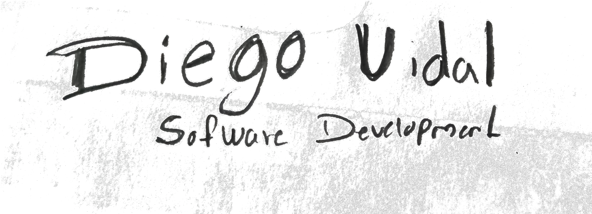

<a name="readme-top"></a>

<div align="center">
  
  <br/>

  <h3><b>To Do List Readme</b></h3>

</div>

<!-- TABLE OF CONTENTS -->

# 📗 Table of Contents

- [📖 About the Project](#about-project)
  - [🛠 Built With](#built-with)
    - [Tech Stack](#tech-stack)
    - [Key Features](#key-features)
  - [🚀 Live Demo](#live-demo)
- [💻 Getting Started](#getting-started)
  - [Prerequisites](#prerequisites)
  - [Setup](#setup)
  - [Install](#install)
  - [Usage](#usage)
  - [Run tests](#run-tests)
  - [Deployment](#deployment)
- [👥 Authors](#authors)
- [🔭 Future Features](#future-features)
- [🤝 Contributing](#contributing)
- [⭐️ Show your support](#support)
- [🙏 Acknowledgements](#acknowledgements)
- [📝 License](#license)

<!-- PROJECT DESCRIPTION -->

# 📖 To-do-List <a name="about-project"></a>

> What is To-do list?

**To-Do list** is a simple project to keep track of the daily activities, You can add, delete or mark as completed your tasks!

## 🛠 Built With <a name="built-with"></a>

### Tech Stack <a name="tech-stack"></a>

> You can see the tech stack used here below:

<details>
  <summary>Client</summary>
  <ul>
    <li><a href="https://developer.mozilla.org/es/docs/Web/HTML">HTML</a></li>
    <li><a href="https://developer.mozilla.org/es/docs/Web/CSS">CSS</a></li>
    <li><a href="https://developer.mozilla.org/es/docs/Web/JavaScript">JavaScript</a></li>
  </ul>
</details>

<details>
  <summary>Server</summary>
  <ul>
    <li><a href="https://pages.github.com/">GitHub Pages</a></li>
  </ul>
</details>

<details>
<summary>Database</summary>
  <ul>
    <li><a href="#">Not Applicable</a></li>
  </ul>
</details>

<!-- Features -->

### Key Features <a name="key-features"></a>

> Some Key Features for this project:

- **Include Local Storage functionality**
- **Add, remove or delete tasks**
- **Mark Items as complete**
- **Clear all completed task**
- **Preserve any modification to the task list**

<p align="right">(<a href="#readme-top">back to top</a>)</p>

<!-- LIVE DEMO -->

## 🚀 Live Demo <a name="live-demo"></a>

> Do you want to play around? take alook to the live demo!

- [To Do list Live Demo](https://diegogagan2587.github.io/To-Do-List/dist/index.html#)

<p align="right">(<a href="#readme-top">back to top</a>)</p>

<!-- GETTING STARTED -->

## 💻 Getting Started <a name="getting-started"></a>

> Do you Want to use the project?

To get a local copy up and running, follow these steps.

### Prerequisites

In order to run this project you need:
- node installed
- git installed
- code editor

<!--
Example command:

```sh
 gem install rails
```
 -->

### Setup

Clone this repository to your desired folder:

```sh
  cd my-folder
  git clone git@github.com:Diegogagan2587/To-Do-List.git
```


### Install

Install this project with:

```sh
  cd my-project
  npm install
```


### Usage

To run the project, execute the following command:

```sh
  npm start
```
### Run tests

so far no test available, let me know if you want to provide any idea!

### Deployment

You can deploy this project using in your own repository using github pages,
more info on the next link.
https://pages.github.com/
<p align="right">(<a href="#readme-top">back to top</a>)</p>

<!-- AUTHORS -->

## 👥 Authors <a name="authors"></a>

> Do you want to know about the creators? take a look!

👤 **Diego vidal Lopez**

- GitHub: [@Diegogagan2587](https://github.com/Diegogagan2587)
- Twitter: [@dieg02587](https://twitter.com/dieg02587)
- LinkedIn: [Diego Vidal Lopez](https://www.linkedin.com/in/diego-vidal2587/?locale=en_US)

<a href="https://www.flaticon.com/free-icons/three-dots" title="three dots icons">Three dots icons created by alkhalifi design - Flaticon</a>

<p align="right">(<a href="#readme-top">back to top</a>)</p>

<!-- FUTURE FEATURES -->

## 🔭 Future Features <a name="future-features"></a>

> features I will add to the project.

- [ ] **Reordering a Selected item(as drag and drop)**

<p align="right">(<a href="#readme-top">back to top</a>)</p>

<!-- CONTRIBUTING -->

## 🤝 Contributing <a name="contributing"></a>

Contributions, issues, and feature requests are welcome!

Feel free to check the [issues page](https://github.com/Diegogagan2587/To-Do-List/issues/2).

<p align="right">(<a href="#readme-top">back to top</a>)</p>

<!-- SUPPORT -->

## ⭐️ Show your support <a name="support"></a>

> Would you like to contribute? Contact me at:

diego27796gagan@gmail.com

<p align="right">(<a href="#readme-top">back to top</a>)</p>

<!-- ACKNOWLEDGEMENTS -->

## 🙏 Acknowledgments <a name="acknowledgements"></a>

> credit to everyone who inspired my project.

I would like to thank to Microverse for providing this challenge.


<p align="right">(<a href="#readme-top">back to top</a>)</p>

<!-- LICENSE -->

## 📝 License <a name="license"></a>

This project is [MIT](./LICENSE) licensed.

<p align="right">(<a href="#readme-top">back to top</a>)</p>